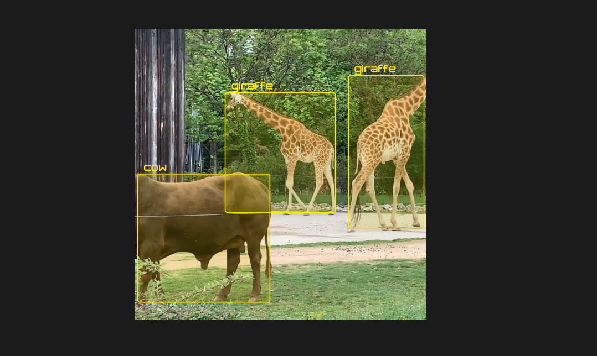

## YOLO Tiny v7 in Unity Sentis Format (Version 1.4.0-pre.3*)
*Version 1.3.0 Sentis files are not compatible with Sentis 1.4.0 and need to be recreated/downloaded

[YOLO v7](https://docs.ultralytics.com/models/yolov7/) is a real-time multi-object recognition model confirmed to run in Unity 2023.

## How to Use
First get the package `com.unity.sentis` from the package manager.
You will also need the Unity UI package.

* Create a new scene in Unity 2023.
* Install `com.unity.sentis` version `1.4.0-pre.3` from the package manager
* Add the c# script to the Main Camera.
* Create a Raw Image in the scene and link it as the `displayImage`
* Put the yolov7-tiny.sentis file in the Assets/StreamingAssets folder
* Put a video file in the Assets/StreamingAssets folder and set the name of videoName to the filename in the script
* Drag the classes.txt on to the labelAssets field
* Set the fields for the bounding box texture sprite and the font

## Preview
If working correctly you should see something like this:

## Information
This version has additional layers which select the most likely bounding boxes. For a version without these additional layers take a look at the [YOLOv8n model](https://huggingface.co/unity/sentis-YOLOv8n).

## Unity Sentis
Unity Sentis is the inference engine that runs in Unity 3D. More information can be found at [here](https://unity.com/products/sentis)

### License
License of YOLO models is GPLv3